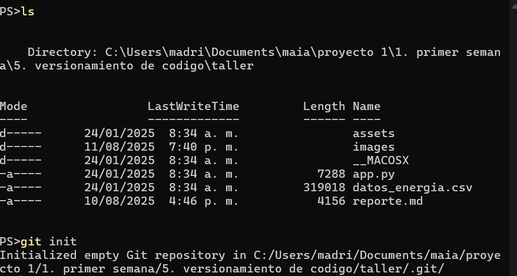
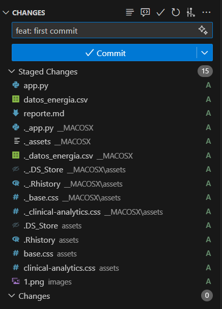
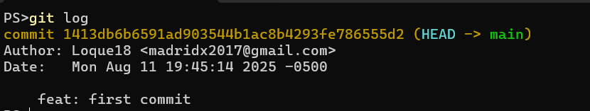
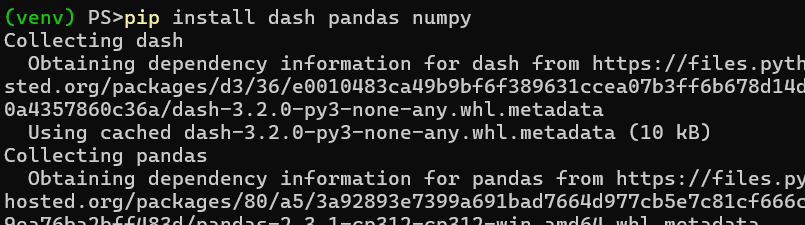
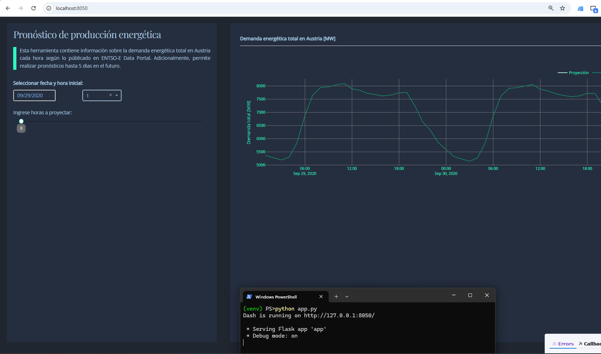
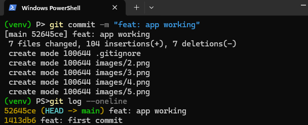
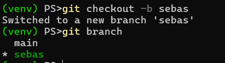
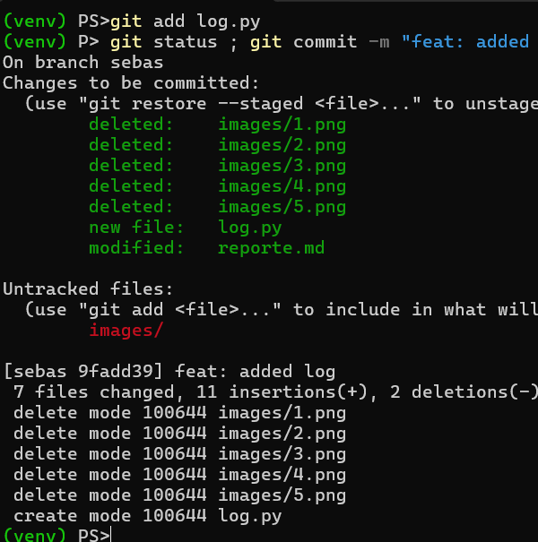

## 1. set up del proyecto

### 1.1 - Descarga y configuración inicial

se descargo los archivos del proyecto, se añadio un .gitignore y se inicializo un nuevo repositorio con el comando `git init`



### 1.2 - Estructura del proyecto

luego se agregaron todos los archivos del proyecto y se realizo un commit inicial con los mismos



### 1.3 - logear commits

para saber en que estado estaba el repositorio se realizo un log de los commits



### 1.3 - Instalación de dependencias

para terminal el proceso de setup se procedio a instalar las dependencias del proyecto con pip dentro de un nuevo entorno virtual de python



## 2. Desarrollo de la aplicación

### 2.1 - Completar código faltante

se completo el codigo faltante en la aplicacion

```py
def load_data():
    # To do: Completar la función
    path = "./datos_energia.csv"
    data = pd.read_csv(path, sep=",")
    data["time"] = pd.to_datetime(data["time"])
    data = data.set_index("time")
    return data
```

### 2.2 - Lanzar la aplicación

Para lanzar la aplicación, se utilizo el siguiente comando en la terminal:

```bash
python app.py
```



### 2.3 - nuevo commit

Se realizo un nuevo commit con los cambios realizados en la aplicación.


## 3. Repositorio remoto

se subieron los archivos de la aplicación a un repositorio remoto en github

ejecutando los siguientes comandos:

```bash
git remote add origin <url-del-repositorio>
git push -u origin master
```



## 4. Despliegue

### 4.1 Configuración de la instancia en AWS

Se creo una instancia en AWS con las siguientes características:

- Tipo de instancia: t2.micro
- Sistema operativo: Ubuntu Server 20.04 LTS
- Almacenamiento: 8 GB SSD
- Grupo de seguridad: Permitir tráfico HTTP y SSH



### 4.2 Conexión y setup de las llaves de despliegue

Se hizo una conexión al servidor por medio de ssh y se genero un keypair para desplegar el proyecto

```sh
# 1. conectarse al servidor
ssh -i "path/to/keypair.pem" ubuntu@54.227.57.218

# 2. generar nuevo keypair ecdsa
ssh-keygen -t ed25519 -C "deploy-key-for-github" -f ~/.ssh/github

# 3. agregar configuración a la carpeta .ssh
touch ~/.ssh/config

# 4. se agrego la siguiente configuración
Host github.com
  HostName github.com
  User git
  IdentityFile ~/.ssh/github

# 5. comprobar que quedo bien configurado
cat ~/.ssh/config

# 6. ver llave publica
cat ~/.ssh/github.pub
```



luego se agrego la clave publica a las claves de despliegue del repositorio en GitHub.


### 4.3 clonación y setup del repositorio

luego se procedio a clonar el repositorio

```bash
# 2. Clonar el repositorio
git clone git@github.com:Loque18/maia-app.git

# 2. Entrar en la carpeta del repositorio
cd maia-app

# 3. cambiar el archivo app.py para servirlo en 0.0.0.0
nano app.py

### 4. verificar que el cambio se aplico
cat app.py

### 5. crear nuevo entorno virtual
python3 -m venv venv

### 6. activarlo
source venv/bin/activate

### 7. instalar dependencias
pip install  dash pandas numpy

### 8. correr la aplicacion
python3 app.py

```


finalmente se accede a la ip con el puerto donde corre la aplicación `http://54.227.57.218:8050` y se puede observar como esta ya esta deslplegada y funciona correctamente

## 5. Conclusiones

La aplicación fue desplegada exitosamente en una instancia de AWS y se pudo acceder a ella a través de la IP pública. El proceso de configuración y despliegue se realizó sin inconvenientes, lo que demuestra la efectividad de la metodología utilizada.

## 6. adjuntos

- [Código fuente de la aplicación](https://github.com/Loque18/maia-app)
